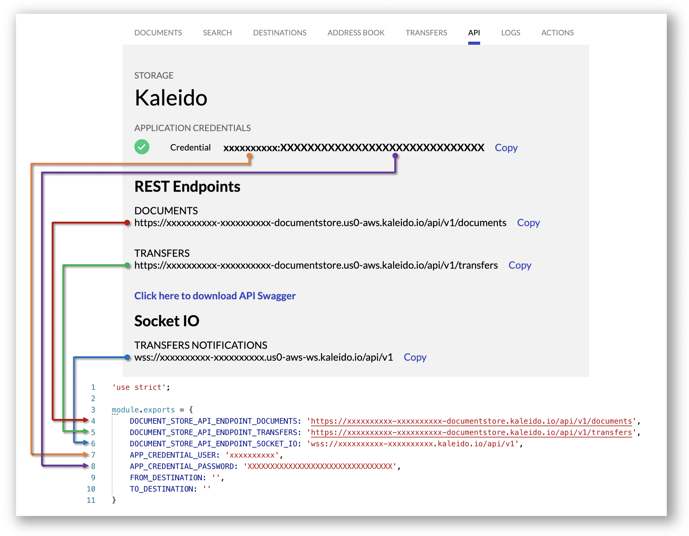

# Document Store Snippets

## Introduction
This repository contains a set of code snippets written in **NodeJS** illustrating how to upload, browser, search, inspect, transfer and delete files programmatically using the Document Store service REST API. It also shows how to listen to document store events using web sockets.

## Getting Started

1. Ensure prerequisites are installed: [Git](https://git-scm.com/), [NodeJS](https://nodejs.org/) and [npm](https://www.npmjs.com/).
2. Clone this repository and install dependencies by running `npm install`.
3. Login to the Kaleido console: https://console.kaleido.io/login. If this is your first time using Kaleido you can register for free here: https://console.kaleido.io/login/signup.
4. Create a consortium and an environment with at least one node (any protocol). Detailed information on completing these steps can be found here: https://docs.kaleido.io/using-kaleido/quick-start.
5. On the environment screen, click on the **Add** button and select **Add Services**. Select **Document Store** and click on **Add**.
6. Look for the **Document Store** entry under **Member Services** and click on it when the status icon turns green.
7. Click on the **API** menu and then on the **Generate New** button under **Application Credentials**. Copy the **Credentials**, **Rest Endpoints** and **Socket IO** values into [./lib/common.js](./lib/common.js) as follows:



> Note: the remaining two steps are only required for document transfers

8. On the Document Store screen, click on the **Destinations** menu and then on the **Setup Destination** button. On the next screen click on **Let Kaleido Register my Org On-Chain**. Type `mydestination` on the destination name input field and click **Finish**.
9. Copy the **destination URI** into [./lib/common.js](./lib/common.js) as follows:


# Snippets

## Upload

```Javascript
'use strict';

const FormData = require('form-data');
const fs = require('fs');
const axios = require('axios');
const common = require('./common');

const formData = new FormData();
formData.append('document', fs.createReadStream(__dirname + '/../resources/kaleido.png'));

axios({
    method: 'put',
    url: common.DOCUMENT_STORE_API_ENDPOINT_DOCUMENTS + '/images/kaleido-logo.png',
    data: formData,
    headers: formData.getHeaders(),
    auth: {
      username: common.APP_CREDENTIAL_USER,
      password: common.APP_CREDENTIAL_PASSWORD
    }
}).then(response => {
    console.log(response.data)
}).catch(err => {
    console.log('Failed to upload document: ' + err);
});
```

> Note: the name of the document in the file system and the service do not necessarily have to match. Also, the directory "images" will be automatically created.

To run the sample code: `npm run upload`

## Browse

```Javascript
'use strict';

const axios = require('axios');
const common = require('./common');

axios({
    url: common.DOCUMENT_STORE_API_ENDPOINT_DOCUMENTS,
    auth: {
      username: common.APP_CREDENTIAL_USER,
      password: common.APP_CREDENTIAL_PASSWORD
    }
}).then(response => {
  console.log(response.data);
}).catch(err => {
  console.log('Failed to browse documents: ' + err);
});
```

> Note: results are paginated with a default limit of 100. Use query strings **offset** and **limit** to iterate through results.

To run the sample code: `npm run browse`

## Search

```Javascript
'use strict';

const axios = require('axios');
const common = require('./common');

const SEARCH_ENDPOINT = common.DOCUMENT_STORE_API_ENDPOINT_DOCUMENTS.substr(0, common.DOCUMENT_STORE_API_ENDPOINT_DOCUMENTS.length - 9);

axios({
    url: SEARCH_ENDPOINT + '/search?query=b5d4c3efcc59b32870af6d3cef645c9d6dbc5580f556316af2aabff768e54d77&by_hash=true',
    auth: {
      username: common.APP_CREDENTIAL_USER,
      password: common.APP_CREDENTIAL_PASSWORD
    }
}).then(response => {
  console.log(response.data);
}).catch(err => {
  console.log('Failed to search for document: ' + err);
});
```
> Note: it is possible to search by document path/name passing `false` in query string **by_hash**. Also, like in the browse API results are paginated.

To run the sample code: `npm run search`

## Metadata

```Javascript
'use strict';

const axios = require('axios');
const common = require('./common');

axios({
    url: common.DOCUMENT_STORE_API_ENDPOINT_DOCUMENTS + '/documents/images/kaleido-logo.png?details_only=true',
    auth: {
      username: common.APP_CREDENTIAL_USER,
      password: common.APP_CREDENTIAL_PASSWORD
    }
}).then(response => {
  console.log(response.data);
}).catch(err => {
  console.log('Failed to browse documents: ' + err);
});
```

To run the sample code: `npm run metadata`

## Download

```Javascript
'use strict';

const fs = require('fs');
const axios = require('axios');
const common = require('./common');

axios({
    url: common.DOCUMENT_STORE_API_ENDPOINT_DOCUMENTS + '/images/kaleido-logo.png',
    auth: {
      username: common.APP_CREDENTIAL_USER,
      password: common.APP_CREDENTIAL_PASSWORD
    },
    responseType: 'stream'
}).then(response => {
  response.data.pipe(fs.createWriteStream(__dirname + '/../resources/kaleido_downloaded.png'));
}).catch(err => {
  console.log('Failed to download document: ' + err);
});
```

To run the sample code: `npm run download`

## Transfer

```Javascript
'use strict';

const axios = require('axios');
const common = require('./common');

axios({
    method: 'post',
    url: common.DOCUMENT_STORE_API_ENDPOINT_TRANSFERS,
    auth: {
      username: common.APP_CREDENTIAL_USER,
      password: common.APP_CREDENTIAL_PASSWORD
    },
    data: {
      from: common.FROM_DESTINATION,
      to: common.TO_DESTINATION,
      document: '/images/kaleido-logo.png'
    }
}).then(response => {
  console.log(response.data);
}).catch(err => {
  console.log('Failed to delete document: ' + err);
});
```

> Note: In a practical destinations would correspond to document store service instances belonging to different organizations. In this example we are using a single service instance just for illustration/test purposes.

To run the sample code: `npm run transfer`

## Delete

```Javascript
'use strict';

const axios = require('axios');
const common = require('./common');

axios({
    method: 'delete',
    url: common.DOCUMENT_STORE_API_ENDPOINT_DOCUMENTS + '/images/kaleido-logo.png',
    auth: {
      username: common.APP_CREDENTIAL_USER,
      password: common.APP_CREDENTIAL_PASSWORD
    }
}).catch(err => {
  console.log('Failed to delete document: ' + err);
});
```

To run the sample code: `npm run delete`

## Events
```Javascript
'use strict';

const io = require('socket.io-client');
const common = require('./common');

io.connect(common.DOCUMENT_STORE_API_ENDPOINT_SOCKET_IO,
  {
    extraHeaders: {
      Authorization: 'Basic ' + Buffer.from(common.APP_CREDENTIAL_USER + ':' + common.APP_CREDENTIAL_PASSWORD).toString('base64')
    }
  }).on('connect', () => {
    console.log('Listening to events');
  }).on('connect_error', err => {
    console.log('Connection error' + err);
  }).on('error', err => {
    console.log('Error:' + err);
  }).on('document_sent', data => {
    console.log('Document sent: ' + JSON.stringify(data));
  }).on('document_received', data => {
    console.log('Document received: ' + JSON.stringify(data));
  }).on('transfer_acknowledgement', data => {
    console.log('Transfer acknowledgement: ' + JSON.stringify(data));
  });
```

> Note: open two terminal windows and run the event snippet in one, and the transfer snippet in the other to see how events in action.

To run the sample code: `npm run events`